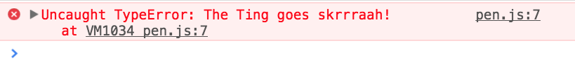

# The JS goes skrrraah!

> pap pap ka ka ka, skibiki pap pap, and a pup pup puuuurrrru pumm

A JavaScript Prollyfill which replaces all error messages in your browser with [Big Shaq's famous quote](https://youtu.be/KZgjdQwuUb8?t=1m44s) _»The Ting goes skrrraah!«_. Just sauce. Raw sauce. No ketchup. Boom.



## Install

Install with `npm`:

```
npm install the-js-goes-skrrraah
```

Install with `yarn`:

```
yarn add the-js-goes-skrrraah
```

## Usage

Add the following line somewhere in your code, preferably at the beginning.

```js
require('the-js-goes-skrrraah')
```

## Features

- 100% Test Coverage
- JS Standard Code Style
- No dependencies!

## LICENSE

See [LICENSE](LICENSE)
